# Homework 2 CSCE 790: Neural Networks and Their Applications

# Part A

## 1

- A new learning procedure called back-propagation is presented for neural network models. It minimizes errors by propagating them backwards to adjust connection weights.

- The network has layers of input, output, and hidden units with weighted connections between them. Input vectors are fed forward to generate output vectors.

- Errors between actual and desired outputs are then propagated backwards. This adjusts the weights and minimizes the errors.   

- The method allows the network to learn internal representations that capture important features of the task domain. The hidden units come to represent key features not explicit in the inputs/outputs.

- The procedure is applied to tasks like detecting input symmetry and storing family tree information. It shows how gradient descent can build useful representations.

- The simplest form is for layered feedforward networks with connections skipping layers but no backwards connections. Inputs are fed forward layer-by-layer to get outputs.

- A linear input function combines inputs before applying nonlinearity for simplicity. The aim is outputs close to the desired vectors.

- Errors are defined as the sum of squared differences between actual and desired outputs. Gradient descent minimizes error by changing weights proportionally. 

- Partial derivatives of the error with respect to each weight are computed in a forward and backward pass. The backward pass propagates derivatives layer-by-layer.

- Weights are changed proportional to the accumulated derivatives over all cases, improving on simpler methods. An acceleration method further improves convergence. 

- Symmetry detection requires intermediate units, as individual inputs alone don't indicate symmetry. The method finds an elegant two-unit solution.

- Family tree information storage shows how features not explicit in inputs/outputs are captured. The network generalizes correctly from limited training.

- Equivalence is shown between layered feedforward networks and recurrent networks run iteratively. The learning procedure extends to recurrent nets.

- Local minima are rarely a big issue, as extra connections provide paths around barriers. Poor minima mainly occur in minimally connected networks.

<div style="page-break-after: always;"></div>

## 2

- The paper analyzes backpropagation convergence to explain phenomena observed in practice and give tricks to avoid undesirable behaviors. Many tricks rarely exposed in serious publications can help backpropagation work well.  

- Stochastic learning is usually much faster than batch learning, especially on large redundant datasets, as it avoids wasteful recomputation. Stochastic learning also often finds better solutions as noise helps weights jump to deeper local minima.

- Input transformations like subtracting means and decorrelating help by improving conditioning and avoiding biases slowing learning. Normalizing variances balances learning rates and scaling down less useful inputs makes them less visible.

- Symmetric sigmoids often converge faster by producing more centered outputs. Adding a small linear term can help avoid flat spots.

- Target values at sigmoid extremes can cause instability as outputs are driven asymptotically to minimize error. Moderate target values utilize nonlinearity without saturating units.

- Random weight initialization with proper standard deviations starts learning in the sigmoid's linear region before nonlinear parts. This captures easier linear mappings first.

- Learning rates should equalize convergence speeds, being proportional to fan-in and typically larger in lower layers. Adaptive techniques can help track changes and avoid oscillations. 

- Momentum damps steps in high curvature directions, increasing the effective rate in low curvature directions. This speeds nonspherical surfaces.

- Conjugate gradient finds descent directions minimizing interference with previous steps through a line search. It works well for small precise problems.

- Quasi-Newton methods estimate the Hessian's inverse without matrix inversion using gradient information. But storage remains impractical for large networks.

- Gauss-Newton uses the Jacobian approximation to the Hessian, requiring means squared error. Levenberg-Marquardt adds regularization to avoid instability.

- Various techniques compute Hessian information without explicit calculation like backpropagating second derivatives. This enables some acceleration.

- Analysis shows problematic effects on the Hessian of non-centered inputs, inter-layer mismatches, and correlations. Tricks address these issues. 

- Classical second-order methods have limited usefulness, but stochastic diagonal Levenberg-Marquardt helps by estimating individual learning rates.

- Computing Hessian eigenvectors without the full matrix can estimate optimal learning rates. The power method iteration or running averages work.

<div style="page-break-after: always;"></div>

# Part B

## 1
The code for this problem can be found on [nn_classification.ipynb](https://github.com/tavasolireza/Neural-Networks-CSCE-790/blob/main/HW2/Part%20B/1/nn_classification.ipynb)

The results are shown in the figures below:
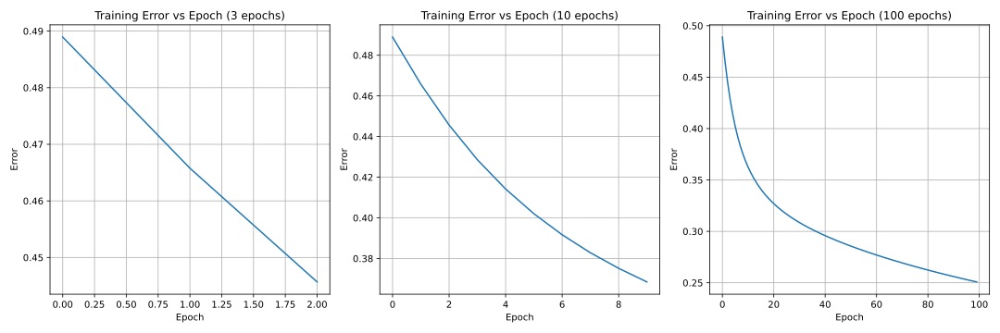

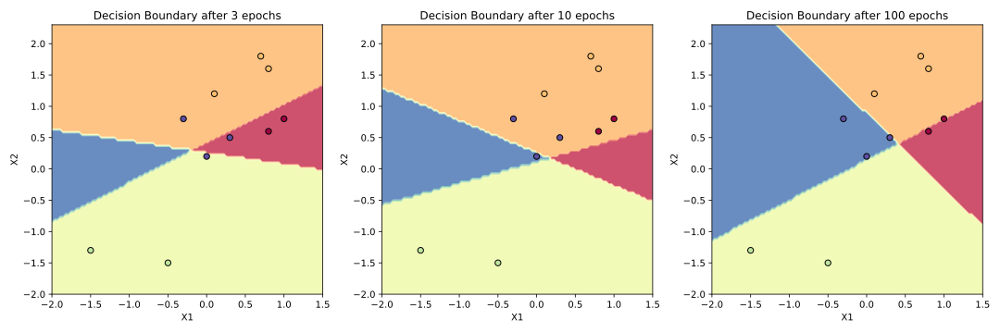
<div style="page-break-after: always;"></div>

## 2
The code for this problem can be found on [approximate.ipynb](https://github.com/tavasolireza/Neural-Networks-CSCE-790/blob/main/HW2/Part%20B/2/approximation.ipynb)

The results are shown in the figures below:

- **Training Error vs. Epoch**

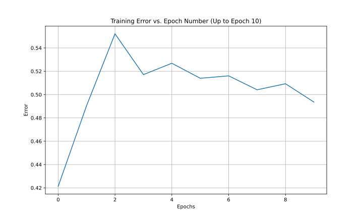 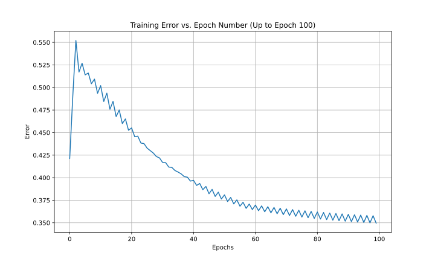   

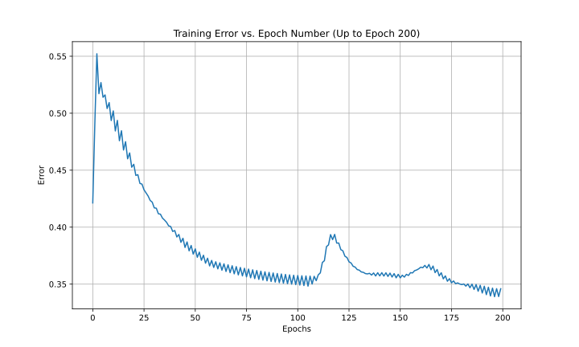 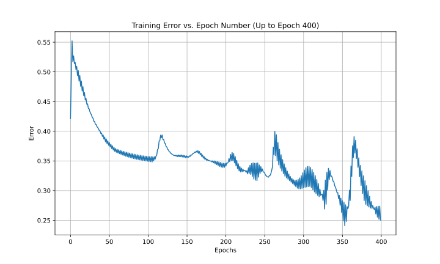 

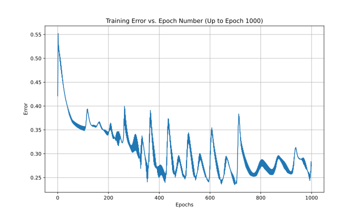

- **NN Output**

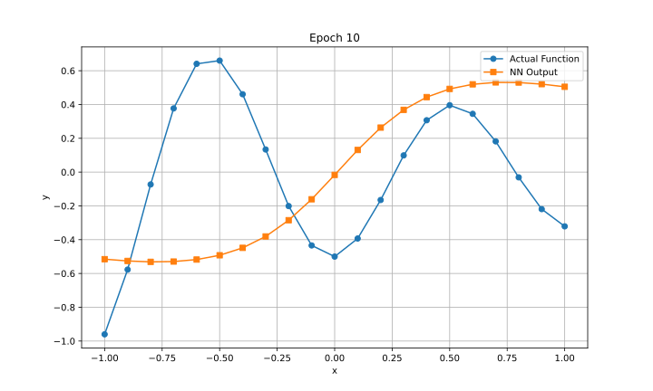 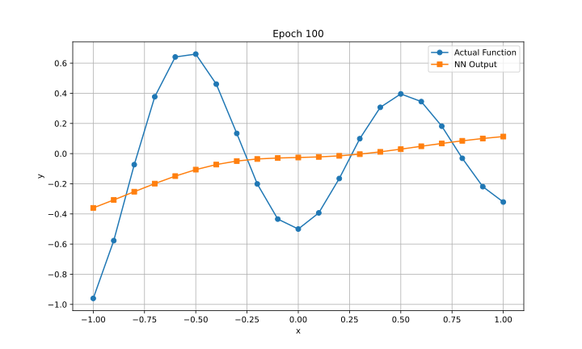   

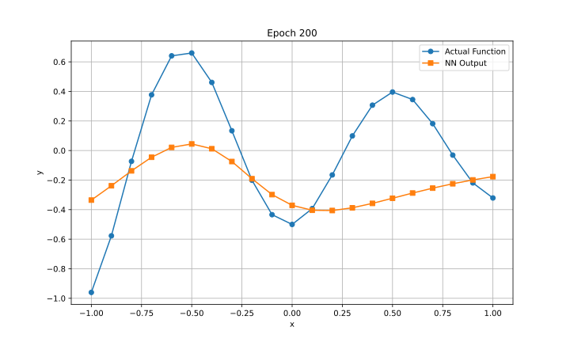 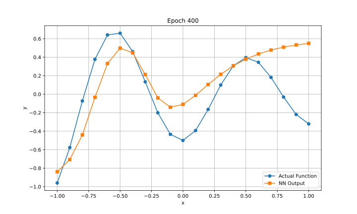 


### e

Increasing the number of neurons in the hidden layers can have different effects depending on the complexity of the dataset and the task at hand. In some cases, it might improve the performance by allowing the network to learn more complex representations. However, it could also lead to overfitting, especially when the dataset is small, as a larger model has more parameters and, hence, more capacity to memorize the training data. In this case, I observerd no siginificant improvement. The figure below shows my findings.


```tex
Final Accuracy for [128, 64] hidden neurons: 0.9731
Final Accuracy for [256, 128] hidden neurons: 0.9769
Final Accuracy for [512, 256] hidden neurons: 0.9755
Final Accuracy for [1024, 512] hidden neurons: 0.9797
Final Accuracy for [2048, 1024] hidden neurons: 0.9776
Final Accuracy for [4096, 2048] hidden neurons: 0.9782
Final Accuracy for [8192, 4096] hidden neurons: 0.981
```

## Problem 2

The code for this problem can be found on [perceptron.ipnyb](https://github.com/tavasolireza/Neural-Networks-CSCE-790/blob/5be27845c8dc7ae2d10a816a823063b6bd69ab3a/HW%201/Problem%202/perceptron.ipynb)

The results are shown in the figures below:

    

## Problem 3

The code for this problem can be found on [two_layer_NN.ipnyb](https://github.com/tavasolireza/Neural-Networks-CSCE-790/blob/5be27845c8dc7ae2d10a816a823063b6bd69ab3a/HW%201/Problem%203/two_layer_NN.ipynb)

The results are shown in the figures below:


## Problem 4

The results:

<figure style="text-align: center;">
  
  <figcaption style="text-align: center;">Layer 1 results</figcaption>
</figure>

<figure style="text-align: center;">
  
  <figcaption style="text-align: center;">Layer 2 results</figcaption>
</figure>

<figure style="text-align: center;">
  
  <figcaption style="text-align: center;">Layer 3 results</figcaption>
</figure>

The codes can be found on [cnn_numpy_scratch.ipnyb](https://github.com/tavasolireza/Neural-Networks-CSCE-790/blob/5be27845c8dc7ae2d10a816a823063b6bd69ab3a/HW%201/Problem%204/cnn_numpy_scratch.ipynb)

This Python code is implementing a basic form of a Convolutional Neural Network (CNN) from scratch using NumPy.

#### 1\. Import Libraries

```python
import numpy
import sys
import skimage.data
import matplotlib.pyplot
```

These lines import the necessary libraries: NumPy for numerical operations, sys for system-specific parameters and functions, skimage for accessing sample images, and matplotlib for plotting.

#### 2\. Convolution Function: `conv_`

```python
def conv_(img, conv_filter):
```

This function performs the convolution operation on an input image `img` with a given filter `conv_filter`. It calculates the feature map by sliding the filter over the image and performing element-wise multiplication followed by summation.

#### 3\. Convolution Layer Function: `conv`

```python
def conv(img, conv_filter):
```

This function handles the application of multiple filters and channels. It checks the dimensions of the image and the filters, then applies the convolution to each filter and sums the results if there are multiple channels. It returns the feature maps.

#### 4\. Pooling Function: `pooling`

```python
def pooling(feature_map, size=2, stride=2):
```

This function applies max pooling to the input feature map. It slides a window of a given `size` over the feature map with a certain `stride` and takes the maximum value within the window.

#### 5\. ReLU Activation Function: `relu`

```python
def relu(feature_map):
```

This function applies the Rectified Linear Unit (ReLU) activation function to the input feature map. It replaces all negative pixel values in the feature map with zero.

#### 6\. Load and Preprocess the Image

```python
img = skimage.data.chelsea()
img = skimage.color.rgb2gray(img)
```

This code loads a sample image of a Chelsea apartment from the `skimage` library and converts it to grayscale.

#### 7\. First Convolutional Layer

```python
l1_filter = numpy.zeros((2,3,3))
...
l1_feature_map = conv(img, l1_filter)
l1_feature_map_relu = relu(l1_feature_map)
l1_feature_map_relu_pool = pooling(l1_feature_map_relu, 2, 2)
```

Here, the first convolutional layer is defined with two filters of size 3x3. The layer is then applied to the image, followed by ReLU activation and pooling.

#### 8\. Second Convolutional Layer

```python
l2_filter = numpy.random.rand(3, 5, 5, l1_feature_map_relu_pool.shape[-1])
...
l2_feature_map = conv(l1_feature_map_relu_pool, l2_filter)
l2_feature_map_relu = relu(l2_feature_map)
l2_feature_map_relu_pool = pooling(l2_feature_map_relu, 2, 2)
```

The second convolutional layer is defined with three randomly initialized filters of size 5x5. The layer is applied to the output of the previous layer, followed by ReLU activation and pooling.

#### 9\. Third Convolutional Layer

```python
l3_filter = numpy.random.rand(1, 7, 7, l2_feature_map_relu_pool.shape[-1])
...
l3_feature_map = conv(l2_feature_map_relu_pool, l3_filter)
l3_feature_map_relu = relu(l3_feature_map)
l3_feature_map_relu_pool = pooling(l3_feature_map_relu, 2, 2)
```

The third convolutional layer is defined with one randomly initialized filter of size 7x7. The layer is applied to the output of the second layer, followed by ReLU activation and pooling.

#### 10\. Results

The resulting feature maps after each layer are stored in the variables `l1_feature_map_relu_pool`, `l2_feature_map_relu_pool`, and `l3_feature_map_relu_pool`.

#### Notes:

*   The code does not involve any learning; it's a forward pass of an image through a CNN with predefined or randomly initialized filters.

## Problem 5

The results:

<figure style="text-align: center;">
  
  <figcaption style="text-align: center;">Original input image</figcaption>
</figure>

<figure style="text-align: center;">
  
  <figcaption style="text-align: center;">The image after applying convolution</figcaption>
</figure>

The codes can be found on [cnn_numpy_scratch.ipnyb](https://github.com/tavasolireza/Neural-Networks-CSCE-790/blob/5be27845c8dc7ae2d10a816a823063b6bd69ab3a/HW%201/Problem%205/cnn_from_scratch.ipynb)

#### 1\. ConvolutionLayer Class

*   **Initialization ( `__init__`)**:
    *   Initializes the number of kernels and their sizes.
    *   Generates random kernel weights, normalized by the square of the kernel size.
*   **Patches Generator ( `patches_generator`)**:
    *   Iterates over the input image, generating patches and their coordinates for the convolution operation.
*   **Forward Propagation ( `forward_prop`)**:
    *   Initializes an output volume to store the convolution results.
    *   Iterates over the patches, performs the convolution operation for each patch with each kernel, and stores the result in the output volume.
*   **Backward Propagation ( `back_prop`)**:
    *   Computes the gradient of the loss function with respect to the kernel weights.
    *   Updates the kernel weights using the computed gradient and a learning rate ( `alpha`).

#### 2\. MaxPoolingLayer Class

*   **Initialization ( `__init__`)**:
    *   Initializes the pooling kernel size.
*   **Patches Generator ( `patches_generator`)**:
    *   Iterates over the input volume, generating patches and their coordinates for the pooling operation.
*   **Forward Propagation ( `forward_prop`)**:
    *   Initializes an output volume to store the pooling results.
    *   Iterates over the patches, performs max pooling for each patch, and stores the result in the output volume.
*   **Backward Propagation ( `back_prop`)**:
    *   Computes the gradient of the loss function with respect to the input of the pooling layer.
    *   There are no weights to update in this layer, but the computed gradient is used to update the weights of the preceding convolutional layer.

#### 3\. SoftmaxLayer Class

*   **Initialization ( `__init__`)**:
    *   Initializes the weights and biases with dimensions corresponding to the input and output units.
*   **Forward Propagation ( `forward_prop`)**:
    *   Flattens the input volume.
    *   Performs matrix multiplication with the weights, adds the biases, and applies the softmax activation function.
*   **Backward Propagation ( `back_prop`)**:
    *   Computes the gradient of the loss function with respect to the weights, biases, and input.
    *   Updates the weights and biases using the computed gradients and a learning rate ( `alpha`).

#### 4. CNN Forward and Backward Propagation Functions

*   **`CNN_forward`**: Takes an image and label, performs forward propagation through the layers, computes the loss and accuracy, and returns the output, loss, and accuracy.
*   **`CNN_backprop`**: Takes the initial gradient and performs backward propagation through the layers, updating the weights.
*   **`CNN_training`**: Calls `CNN_forward` and `CNN_backprop`, returns the loss and accuracy.

#### 5. Comparison with problem 4

#### Defining CNN Layers:

*   In the first algorithm, the convolutional layers were defined using functions and arrays, with each layer applying convolution, ReLU activation, and pooling sequentially. The filters for the convolutional layers were either predefined or randomly initialized.
*   In the second algorithm, an object-oriented approach is used to define each layer as a class with its methods for forward and backward propagation. The convolutional layer is defined with random kernel weights, the max-pooling layer with a specified pooling size, and the softmax layer with initialized weights and biases based on input and output units.

#### Pooling:

*   Both algorithms use max-pooling, but the implementation details differ. In the first algorithm, the pooling function is separate and applies pooling to the feature maps. In the second algorithm, the max-pooling layer is a class with its forward and backward propagation methods.

#### Softmax Layer:

*   The first algorithm does not include a softmax layer, as it does not perform classification and is not trained on a dataset.
*   The second algorithm includes a softmax layer as the final layer of the CNN for classification purposes. The softmax layer computes the probability distribution of the classes and is part of the training process.

#### Backpropagation and Weight Updates:

*   The first algorithm does not include backpropagation or weight updates since it only demonstrates a forward pass.
*   The second algorithm includes methods for backward propagation in each layer class, computes gradients, and updates the weights of the convolutional and softmax layers during training.

## Problem 6

The results:

##### The MLP model

```
Train accuracy: 97.14%
Val accuracy:   54.60%
Test accuracy:  60.60%
```

##### The GNN model

```
Train accuracy: 100.00%
Val accuracy:   78.60%
Test accuracy:  82.40%
```

##### The GraphConv model

```
Train performance: 93.28%
Test performance:  92.11%
```

The codes can be found on [t7_gnn.ipnyb](https://github.com/tavasolireza/Neural-Networks-CSCE-790/blob/5be27845c8dc7ae2d10a816a823063b6bd69ab3a/HW%201/Problem%206/t7_gnn.ipynb)

## Graph Neural Networks Tutorial Overview

## 1. Graph Representation
### Concept:
The tutorial initiates by laying down the basics of graph representation. It explains that a graph, denoted as G, is made up of nodes (V) and edges (E). The relationships or connections between the nodes are represented using an adjacency matrix A. In this matrix, the element in the i-th row and j-th column is 1 if there is a connection between nodes i and j, and 0 otherwise.

### Code:
In the code section, the notebook demonstrates this concept by defining an example graph with nodes and edges and subsequently forming its adjacency matrix. Python arrays or lists are used to create the adjacency matrix manually, where rows and columns symbolize nodes, and the binary elements indicate the presence or absence of edges between the corresponding nodes.

## 2. Graph Convolutional Networks (GCNs)
### Concept:
GCNs operate by enabling nodes in a graph to exchange information with their neighboring nodes. In a GCN layer, the features of each node at the next layer are calculated by applying a transformation to the aggregated features of the neighboring nodes and the node itself. The transformation includes a weight matrix, and the results are passed through an activation function. The process includes adding self-connections to nodes and normalizing the features by the number of neighbors.

### Code:
The implementation in PyTorch involves initializing the node features and the adjacency matrix, adding self-connections, normalizing by the number of neighbors, and applying the GCN layer to compute the next layer's features. The weight matrix is typically initialized as an identity matrix for simplicity.

## 3. Graph Attention Networks (GATs)
### Concept:
GATs utilize attention mechanisms to dynamically assign different importances to the neighboring nodes when aggregating their features. The attention mechanism computes attention weights based on the features of the nodes and applies a non-linear transformation (LeakyReLU) before normalization (softmax).

### Code:
This part demonstrates the detailed construction of a GAT layer in PyTorch, specifying the computation of attention weights and their utilization for aggregating features. The implementation showcases the use of multiple attention heads for enhanced model expressiveness and diversity.

## 4. PyTorch Geometric
### Concept:
PyTorch Geometric is introduced as a specialized library for GNNs, offering a variety of graph layers, efficient handling of graph-structured data, and a collection of datasets for experimentation.

### Code:
This part guides users through the installation of PyTorch Geometric, loading graph datasets, representing graphs using `Data` objects, and accessing various graph attributes such as edge indices and node features. 

## 5. Node-level Tasks and Experiments
### Concept:
The tutorial explores node-level tasks, specifically using the Cora dataset for semi-supervised node classification. Each publication in the dataset is represented by a bag-of-words vector and categorized into one of seven classes.

### Code:
The code segments involve constructing a GNN model using defined graph layers, incorporating ReLU activation, and applying dropout for regularization. An MLP baseline model is also implemented for comparison. The models are integrated into a PyTorch Lightning module, with code provided for training, validation, testing, and performance evaluation on the Cora dataset.


## Problem 7

For this part, I got help from the following links:

1. https://medium.com/codex/python-and-physics-lorenz-and-rossler-systems-65735791f5a2
2. https://github.com/hukenovs/chaospy
3. https://thebrickinthesky.wordpress.com/2013/02/23/maths-with-python-2-rossler-system/

The codes can be found on [reservoir_observers.ipnyb](https://github.com/tavasolireza/Neural-Networks-CSCE-790/blob/5be27845c8dc7ae2d10a816a823063b6bd69ab3a/HW%201/Problem%207/reservoir_observers.ipynb)

The results:


### 1. Simulation of Dynamical Systems

#### 1.1 Rossler System
- **Equations**: 
  $$
  [ \frac{dx}{dt} = -y - z ], 
  [ \frac{dy}{dt} = x + 0.5y ],
  [ \frac{dz}{dt} = 2.0 + z(x - 4.0) ]
  $$
  
- **Method**: Used the first-order Euler approximation with a time step of `0.01` and simulated for a total time of `100` units.
- **Data Generation**: Generated a time series of 8000 samples for training and 2000 samples for testing.

#### 1.2 Lorenz System
- **Equations**: 
  $$
  [ \frac{dx}{dt} = 10(y - x) ],
  [ \frac{dy}{dt} = x(28 - z) - y ],
  [ \frac{dz}{dt} = xy - \frac{8}{3}z ]
  $$
  
- **Method**: Similar to the Rossler system, used the Euler approximation for simulation.
- **Data Generation**: Produced training and testing datasets with the same number of samples as the Rossler system.

### 2. Implementation of Reservoir Computing

- **Model Structure**: The reservoir computing model consisted of three layers: an input layer, a reservoir layer with `100` nonlinear nodes, and a linear output layer.
- **Dynamics**: The reservoir dynamics were defined as 
  $$
   r(t + \delta t) = (1-a)r(t) + a \tanh(Ar(t) + W_{\text{in}}u(t)) 
  $$
  where \(a=0.5\), \(A\) is the adjacency matrix, W is the input weight matrix, and \(u(t)\) is the input signal.
- **Training**: The model was trained using ridge regression with a regularization parameter of `1e-6`. The reservoir states were updated and stored, forming the feature matrix for regression, and the output weights were learned to map the reservoir states to the target outputs.

### 3. Evaluation and Results

- **Testing**: The trained models were tested on unseen data from the Rossler and Lorenz systems. The reservoir states were updated using the test input, and predictions were made using the learned output weights.
- **Performance Metrics**: The mean squared error (MSE) was calculated to quantify the difference between the predicted and actual states.
  - Rossler system: MSE ≈ 4.24
  - Lorenz system: MSE ≈ 1.89

### 4. Visualizations

- **3D Trajectory Plots**: The plots showed the actual and predicted trajectories in the phase space for both the Rossler and Lorenz systems, illustrating the ability of the models to capture the chaotic dynamics.
- **Time Series Plots**: The time series for each coordinate (X, Y, Z) were plotted for both systems, demonstrating the close alignment between the predicted and actual time series over time.
