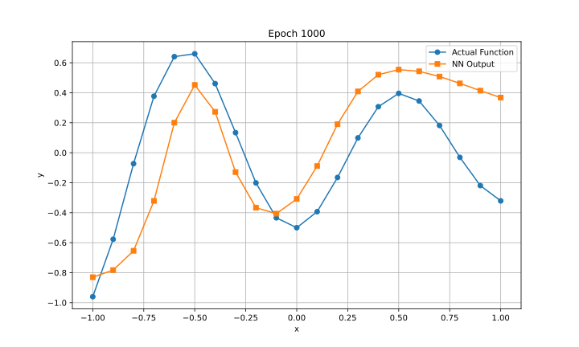

# Homework 2 CSCE 790: Neural Networks and Their Applications

# Part A

## 1

- A new learning procedure called back-propagation is presented for neural network models. It minimizes errors by propagating them backwards to adjust connection weights.

- The network has layers of input, output, and hidden units with weighted connections between them. Input vectors are fed forward to generate output vectors.

- Errors between actual and desired outputs are then propagated backwards. This adjusts the weights and minimizes the errors.   

- The method allows the network to learn internal representations that capture important features of the task domain. The hidden units come to represent key features not explicit in the inputs/outputs.

- The procedure is applied to tasks like detecting input symmetry and storing family tree information. It shows how gradient descent can build useful representations.

- The simplest form is for layered feedforward networks with connections skipping layers but no backwards connections. Inputs are fed forward layer-by-layer to get outputs.

- A linear input function combines inputs before applying nonlinearity for simplicity. The aim is outputs close to the desired vectors.

- Errors are defined as the sum of squared differences between actual and desired outputs. Gradient descent minimizes error by changing weights proportionally. 

- Partial derivatives of the error with respect to each weight are computed in a forward and backward pass. The backward pass propagates derivatives layer-by-layer.

- Weights are changed proportional to the accumulated derivatives over all cases, improving on simpler methods. An acceleration method further improves convergence. 

- Symmetry detection requires intermediate units, as individual inputs alone don't indicate symmetry. The method finds an elegant two-unit solution.

- Family tree information storage shows how features not explicit in inputs/outputs are captured. The network generalizes correctly from limited training.

- Equivalence is shown between layered feedforward networks and recurrent networks run iteratively. The learning procedure extends to recurrent nets.

- Local minima are rarely a big issue, as extra connections provide paths around barriers. Poor minima mainly occur in minimally connected networks.

## 2

- The paper analyzes backpropagation convergence to explain phenomena observed in practice and give tricks to avoid undesirable behaviors. Many tricks rarely exposed in serious publications can help backpropagation work well.  

- Stochastic learning is usually much faster than batch learning, especially on large redundant datasets, as it avoids wasteful recomputation. Stochastic learning also often finds better solutions as noise helps weights jump to deeper local minima.

- Input transformations like subtracting means and decorrelating help by improving conditioning and avoiding biases slowing learning. Normalizing variances balances learning rates and scaling down less useful inputs makes them less visible.

- Symmetric sigmoids often converge faster by producing more centered outputs. Adding a small linear term can help avoid flat spots.

- Target values at sigmoid extremes can cause instability as outputs are driven asymptotically to minimize error. Moderate target values utilize nonlinearity without saturating units.

- Random weight initialization with proper standard deviations starts learning in the sigmoid's linear region before nonlinear parts. This captures easier linear mappings first.

- Learning rates should equalize convergence speeds, being proportional to fan-in and typically larger in lower layers. Adaptive techniques can help track changes and avoid oscillations. 

- Momentum damps steps in high curvature directions, increasing the effective rate in low curvature directions. This speeds nonspherical surfaces.

- Conjugate gradient finds descent directions minimizing interference with previous steps through a line search. It works well for small precise problems.

- Quasi-Newton methods estimate the Hessian's inverse without matrix inversion using gradient information. But storage remains impractical for large networks.

- Gauss-Newton uses the Jacobian approximation to the Hessian, requiring means squared error. Levenberg-Marquardt adds regularization to avoid instability.

- Various techniques compute Hessian information without explicit calculation like backpropagating second derivatives. This enables some acceleration.

- Analysis shows problematic effects on the Hessian of non-centered inputs, inter-layer mismatches, and correlations. Tricks address these issues. 

- Classical second-order methods have limited usefulness, but stochastic diagonal Levenberg-Marquardt helps by estimating individual learning rates.

- Computing Hessian eigenvectors without the full matrix can estimate optimal learning rates. The power method iteration or running averages work.

# Part B

## 1
The code for this problem can be found on [nn_classification.ipynb](https://github.com/tavasolireza/Neural-Networks-CSCE-790/blob/main/HW2/Part%20B/1/nn_classification.ipynb)

The results are shown in the figures below:

## 2
The code for this problem can be found on [approximate.ipynb](https://github.com/tavasolireza/Neural-Networks-CSCE-790/blob/main/HW2/Part%20B/2/approximation.ipynb)

The results are shown in the figures below:

- **Training Error vs. Epoch**

    

  

- **NN Output**

    

  

## 3
The code for this problem can be found on [hopfield.ipynb](https://github.com/tavasolireza/Neural-Networks-CSCE-790/blob/main/HW2/Part%20B/3/hopfield.ipynb)

The results are shown in the figures below:

## 4
The code for this problem can be found on [transformer.ipynb](https://github.com/tavasolireza/Neural-Networks-CSCE-790/blob/main/HW2/Part%20B/4/transformer.ipynb)

### Description:
### 1. Define Basic Building Blocks

#### 1.1 Multi-Head Attention:
- **Purpose**: To compute attention scores between each pair of positions in a sequence. This allows the model to focus on different aspects of the input sequence.
- **Components**:
  - Multiple attention heads that process the input in parallel and capture different relationships.
  - Linear transformation layers that transform the input.
- **How it works**:
  1. Initialize the module with input parameters and define the linear transformation layers.
  2. Calculate attention scores.
  3. Reshape the input tensor to create multiple heads.
  4. Combine the attention outputs from all heads.

#### 1.2 Position-wise Feed-Forward Networks:
- **Purpose**: To transform the output of the attention layers.
- **Components**:
  - Two linear transformation layers.
  - A ReLU activation function.
- **How it works**:
  1. Initialize the class with the transformation layers and the activation function.
  2. During the forward pass, apply the transformations and activation function sequentially.

#### 1.3 Positional Encoding:
- **Purpose**: To provide the model with information about the position of tokens in the sequence since the Transformer does not have any inherent notion of order.
- **Components**:
  - Sine and cosine functions used to generate position-specific values.
- **How it works**:
  1. Initialize the class and create a tensor to store positional encoding values.
  2. Calculate sine and cosine values for different positions.
  3. During the forward pass, add the positional encoding values to the input tensor.

### 2. Building Encoder and Decoder Layers

#### 2.1 Encoder Layer:
- **Components**:
  - Multi-Head Attention layer.
  - Position-wise Feed-Forward layer.
  - Two Layer Normalization layers.
- **How it works**:
  1. Initialize the class with its components.
  2. During the forward pass, apply self-attention, then add the attention output to the input tensor and normalize it.
  3. Compute the position-wise feed-forward output, combine it with the normalized self-attention output, and normalize again.

#### 2.2 Decoder Layer:
- **Components**:
  - Two Multi-Head Attention layers (for masked self-attention and cross-attention).
  - Position-wise Feed-Forward layer.
  - Three Layer Normalization layers.
- **How it works**:
  1. Initialize the class with its components.
  2. During the forward pass:
     - Calculate the masked self-attention output, add it to the input, apply dropout, and normalize.
     - Compute cross-attention between decoder and encoder outputs, normalize, and combine with masked self-attention.
     - Calculate position-wise feed-forward output, combine with previous outputs, apply dropout, and normalize.

### 3. Build the Complete Transformer Model

#### 3.1 Transformer Model:
- **Components**:
  - Embedding layers for source and target sequences.
  - Positional Encoding module.
  - Stacked Encoder and Decoder layers.
  - Linear layer for projecting decoder output.
- **How it works**:
  1. Initialize the class and its components.
  2. Define the `generate_mask` method to create masks for source and target sequences.
  3. During the forward pass:
     - Generate masks for source and target sequences.
     - Compute embeddings and apply positional encoding and dropout.
     - Process the source sequence through the encoder layers.
     - Process the target sequence through the decoder layers, using encoder outputs and masks.
     - Apply the linear projection layer to the decoder output to obtain the final logits.

The Transformer model processes input sequences and produces output sequences by combining the functionalities of its components, ensuring attention is paid to relevant parts of the input and capturing complex relationships between input and output.

## 5
***a)*** The code for the vanilla GAN can be found on [vanilla_GAN.ipynb](https://github.com/tavasolireza/Neural-Networks-CSCE-790/blob/main/HW2/Part%20B/5/vanilla_GAN.ipynb)

*Vanilla GAN output.*

### Description:
#### 1. Data Loading and Preprocessing:

- **Purpose**: Load the MNIST dataset, preprocess it, and create a DataLoader for batching.
- **Components**:
  - `mnist_data()`: function to load and preprocess the MNIST dataset.
  - `data_loader`: DataLoader to load batches of data.
- **How it works**:
  1. Use the `mnist_data` function to load the dataset with normalization.
  2. Create a DataLoader with a batch size of 100 and shuffling enabled.

#### 2. Discriminator Network:

- **Purpose**: Distinguish between real and fake (generated) images.
- **Components**:
  - Three hidden layers with dropout and LeakyReLU activation.
  - Output layer with sigmoid activation.
- **How it works**:
  1. Initialize the layers in the `__init__` method.
  2. During the forward pass, process the input through each hidden layer sequentially and then through the output layer.

#### 3. Generator Network:

- **Purpose**: Generate fake images from random noise.
- **Components**:
  - Three hidden layers with LeakyReLU activation.
  - Output layer with Tanh activation.
- **How it works**:
  1. Initialize the layers in the `__init__` method.
  2. During the forward pass, process the noise through each hidden layer sequentially and then through the output layer.

#### 4. Optimization:

- **Purpose**: Define optimizers and loss functions for training.
- **Components**:
  - Adam optimizer for both discriminator and generator.
  - Binary Cross Entropy (BCE) loss.
- **How it works**:
  1. Initialize the optimizers with the respective model parameters and a learning rate of 0.0002.
  2. Use BCE loss to compare the model's output against real (1) or fake (0) labels.

#### 5. Training:

- **Purpose**: Train both the discriminator and generator.
- **Components**:
  - `train_discriminator`: Function to train the discriminator with real and fake data.
  - `train_generator`: Function to train the generator to produce fake data that the discriminator thinks are real.
- **How it works**:
  1. For each epoch and batch, get real data and generate fake data.
  2. Train the discriminator with both real and fake data.
  3. Train the generator with the generated fake data.
  4. Log errors, display progress, and save models at specified intervals.

#### 6. Visualization and Logging:

- **Purpose**: Monitor the training process and visualize generated images.
- **Components**:
  - `Logger` class from the `utils` module (not provided in the code).
- **How it works**:
  1. Initialize the logger.
  2. During training, after specific intervals, clear the display.
  3. Display generated images and log the training status.
  4. Save model checkpoints.

***b)***  The code for the DC GAN can be found on [DC_GAN.ipynb](https://github.com/tavasolireza/Neural-Networks-CSCE-790/blob/main/HW2/Part%20B/5/DC_GAN.ipynb)

*DC-GAN output.*

### Description:
#### 1. Data Loading and Preprocessing:

- **Purpose**: Load the MNIST dataset, preprocess it by resizing and normalization, and create a DataLoader for batching.
- **Components**:
  - `mnist_data()`: function to load and preprocess the MNIST dataset.
  - `data_loader`: DataLoader to load batches of data.
- **How it works**:
  1. Use the `mnist_data` function to load the dataset with resizing and normalization.
  2. Create a DataLoader with a batch size of 100 and shuffling enabled.

#### 2. Discriminator Network:

- **Purpose**: Distinguish between real and fake (generated) images.
- **Components**:
  - Four convolutional layers with batch normalization and LeakyReLU activation.
  - Fully connected output layer with sigmoid activation.
- **How it works**:
  1. Initialize the convolutional and output layers in the `__init__` method.
  2. During the forward pass, process the input through each convolutional layer sequentially, flatten the result, and then process through the output layer.

#### 3. Generator Network:

- **Purpose**: Generate fake images from random noise.
- **Components**:
  - One fully connected layer to reshape the noise.
  - Four transposed convolutional layers with batch normalization and ReLU activation (except the last one).
  - Tanh activation at the output.
- **How it works**:
  1. Initialize the layers in the `__init__` method.
  2. During the forward pass, project and reshape the noise, process it through each transposed convolutional layer sequentially, and finally apply Tanh activation.

#### 4. Optimization:

- **Purpose**: Define optimizers and loss functions for training.
- **Components**:
  - Adam optimizer for both discriminator and generator.
  - Binary Cross Entropy (BCE) loss.
- **How it works**:
  1. Initialize the optimizers with the respective model parameters, learning rate of 0.0002, and specific betas.
  2. Use BCE loss to compare the model's output against real (1) or fake (0) labels.

#### 5. Training:

- **Purpose**: Train both the discriminator and generator.
- **Components**:
  - `train_discriminator`: Function to train the discriminator with real and fake data.
  - `train_generator`: Function to train the generator to produce fake data that the discriminator thinks are real.
- **How it works**:
  1. For each epoch and batch, get real data and generate fake data.
  2. Train the discriminator with both real and fake data.
  3. Train the generator with the generated fake data.
  4. Log errors, display progress, and save models at specified intervals.

#### 6. Visualization and Logging:

- **Purpose**: Monitor the training process and visualize generated images.
- **Components**:
  - `Logger` class from the `utils` module (not provided in the code).
- **How it works**:
  1. Initialize the logger.
  2. During training, after specific intervals, clear the display.
  3. Display generated images and log the training status.
  4. Save model checkpoints.

# Part C

## 1
